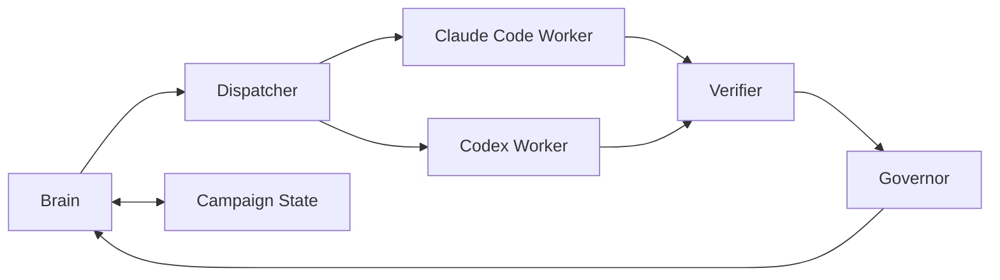

# Multi-Agent Control Plane MVP Plan

**Goal:** Ship the smallest useful version of the multi-agent research control plane that can run one bounded experiment loop end-to-end: `Brain -> Dispatcher -> Worker -> Verifier -> Governor`.

**Non-Goal:** This MVP does not aim to support arbitrary parallelism, advanced learning-based routing, or production-grade backend isolation.

## MVP Scope

### Included

- Single-question campaign state
- One `ExperimentBrief` at a time
- Task decomposition into:
  - `code_and_run`
  - `repair`
  - `analysis`
- Two worker backends:
  - `claude_code`
  - `codex`
- Rule-based worker routing
- Minimal independent verifier
- Three governor modes as config presets
- One-iteration orchestration
- Resume-safe campaign loop

### Excluded

- `opencode` backend
- Parallel task graphs
- Dynamic skill recommendation
- Automatic literature retrieval workers
- Multi-stage reproducibility reruns
- Learned routing or scoring

## MVP Architecture

## Required Files

- `src/controlplane/schemas/experiment_brief.py`
- `src/controlplane/schemas/task_packet.py`
- `src/controlplane/schemas/worker_result.py`
- `src/controlplane/schemas/verification_report.py`
- `src/controlplane/brain/planner.py`
- `src/controlplane/brain/decomposer.py`
- `src/controlplane/dispatcher/router.py`
- `src/controlplane/dispatcher/launchers/claude_code.py`
- `src/controlplane/dispatcher/launchers/codex.py`
- `src/controlplane/verifier/completion_judge.py`
- `src/controlplane/governor/decisions.py`
- `src/controlplane/orchestrator/iteration_loop.py`
- `src/controlplane/orchestrator/campaign_loop.py`

## MVP Data Contracts

### ExperimentBrief

- `experiment_id`
- `objective`
- `hypothesis_links`
- `inputs`
- `constraints`
- `deliverables`
- `acceptance_criteria`
- `decomposition_hint`
- `preferred_worker_profile`

### TaskPacket

- `task_id`
- `experiment_id`
- `task_type`
- `goal`
- `worker_requirements`
- `deliverables`
- `acceptance_criteria`
- `retry_policy`

### WorkerResult

- `task_id`
- `worker_id`
- `status`
- `deliverable_paths`
- `summary`

### VerificationReport

- `task_id`
- `status`
- `failures`
- `warnings`
- `recommended_brain_action`

## MVP Behavior

### Brain

- Select exactly one next experiment from backlog
- Create one `ExperimentBrief`
- Decompose into one or two `TaskPacket`s
- Update campaign state after verification

### Dispatcher

- Pick worker by `task_type`
- Prefer `claude_code` for `repair`
- Prefer `claude_code` or `codex` for `code_and_run`
- Use fallback backend from `retry_policy` if first worker fails

### Worker

- Consume `TaskPacket`
- Produce `WorkerResult`
- Write declared deliverables only

### Verifier

- Confirm all required deliverables exist
- Confirm worker status is `success`
- Confirm result note or metrics artifact exists when required
- Return `accept` or `rework`

### Governor

- Return one of:
  - `CONTINUE`
  - `REFINE`
  - `ESCALATE`
  - `STOP`
- `PIVOT` is allowed by schema but can be deferred in MVP implementation

## MVP Success Criteria

The MVP is done when all of these are true:

1. A campaign can be initialized from CLI.
2. One iteration can generate an `ExperimentBrief`.
3. The brief can be decomposed into at least one `TaskPacket`.
4. A task can be routed to either `claude_code` or `codex`.
5. A stubbed worker can return a `WorkerResult`.
6. The verifier can independently accept or reject the result.
7. The governor can produce the next action.
8. The campaign loop can stop or continue across multiple iterations.

## Recommended Build Order

1. Schemas
2. Planner + decomposer
3. Router + worker registry
4. Verifier
5. Governor
6. Iteration loop
7. Campaign loop
8. CLI

## Implementation Cuts

If the build feels too large, cut in this order:

1. Drop `analysis` tasks from MVP
2. Drop automatic fallback, keep primary routing only
3. Drop resume support until single iteration is stable
4. Keep only `moderate_autonomy` preset first, add other modes second

## First Demo Scenario

Use exactly one demo scenario for the first end-to-end run:

- Research question: `Does method X improve robustness under synthetic label noise?`
- Backlog contains one candidate experiment
- Brain emits one `code_and_run` task
- Worker returns:
  - `metrics.json`
  - `run.log`
  - `result_note.md`
- Verifier checks files and returns `accept`
- Governor returns `CONTINUE`

## Risks To Watch

- Brain producing overly broad briefs
- Worker silently modifying scope
- Verifier being too shallow and accepting fake completion
- Too much backend-specific logic leaking into the orchestrator

## Practical Recommendation

Do not implement the full plan directly. Build this MVP first, then expand in three passes:

1. Add stronger verification
2. Add richer task types and parallel decomposition
3. Add more backends and skills
